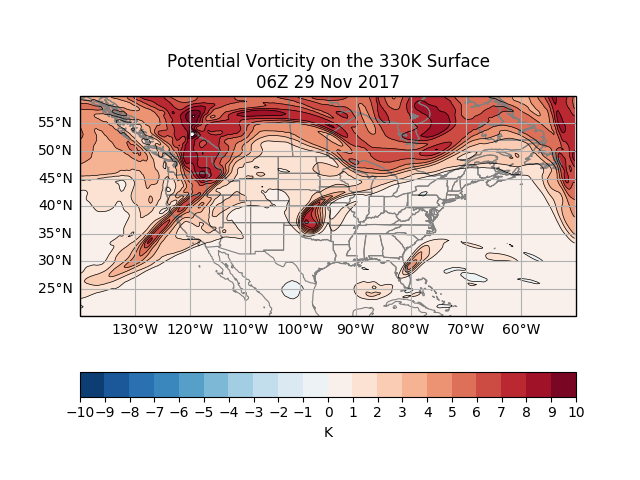

# potential-vorticity

Python code (<b>gfs_pv_1.2.py</b>) for dynamic tropopause (DT) calculations: DT pressure, DT potential temperature (theta), PV on 
the 330K isentropic surface, and a PV and theta cross-section at the latitude where the tropopause is lowest in the 
domain. The date and time need to be set in the beginning of the code; the domain can be changed there as well.

<b>gfs_pv_1.2_3D.py</b> is the same code but with additional (poor) 3D plots

This code has a DOI and is citable:  

The data source is the online GFS analysis, and the date and time need to be set within the period of available data.

The program can take a few minutes to run because it is accessing data over the internet.

Samples of the four figures that are generated are included as PNG files:

