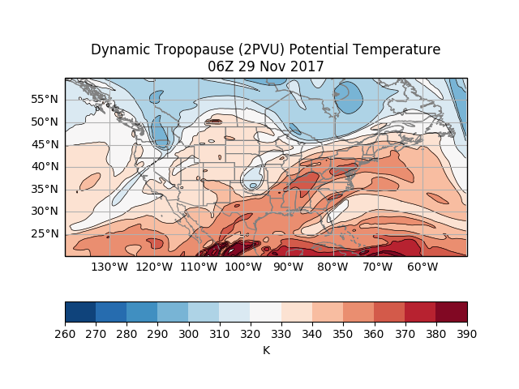
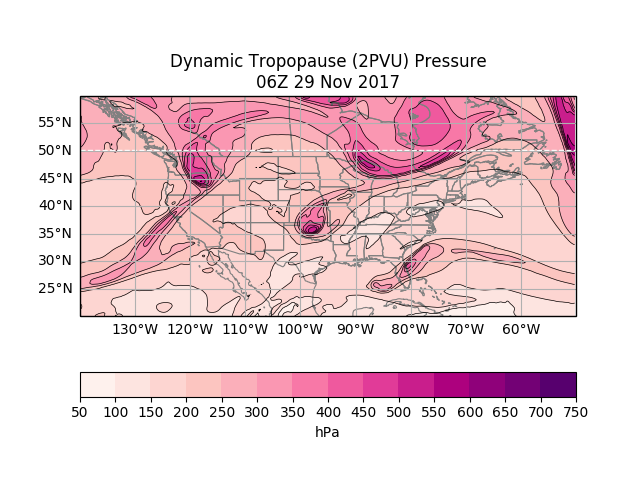

# potential-vorticity

Python code for dynamic tropopause (DT) calculations: DT pressure, DT potential temperature (theta), PV on 
the 330K isentropic surface, and a PV-theta cross-section at the latitude where the tropopause is lowest in the 
domain.

The data source is the online GFS analysis, where the date and time need to be set within the code.

The program can take a few minutes to run because it is accessing data over the internet.

Samples of the four figures that are generated are included as PNG files:

